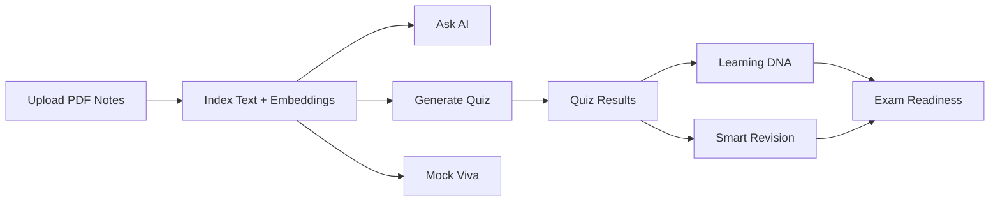

# PrepWise AI

PrepWise AI is an AI-powered study platform that turns static PDF notes into an active learning workspace. It combines note-grounded Q&A, auto-generated quizzes, revision planning, learning analytics, readiness scoring, and mock viva practice in one full-stack application.

## Overview

Most study apps stop at storage or flashcards. PrepWise AI is built around a richer loop:

1. upload notes
2. index them for semantic search
3. ask grounded questions
4. generate quizzes from your own material
5. track retention and study behaviour
6. estimate exam readiness
7. practise viva-style responses with AI feedback

The result is a system that treats your notes as a living knowledge base instead of a passive document archive.

## Features

| Module | What it does |
| --- | --- |
| Notes manager | Upload, list, download, and delete PDF study notes, with per-note indexing status |
| Ask AI | Answers questions using retrieved content from uploaded notes |
| Quiz engine | Generates `MCQ`, `Short Answer`, and `Mixed` quizzes from note context |
| Learning DNA | Builds a behaviour-based study profile from activity and performance history |
| Smart revision | Estimates topic retention with an Ebbinghaus-style forgetting curve |
| Exam readiness | Calculates a weighted readiness score across multiple study signals |
| Mock viva | Runs viva-style question sessions and evaluates answers with AI |

## Product flow



## Architecture

```text
React SPA
   ↓
FastAPI backend
   ├── MongoDB      -> users, notes, note chunks + embeddings, results, analytics, viva
   ├── Local disk   -> uploaded PDFs
   ├── Gemini       -> generation, evaluation, recommendations
   └── MiniLM (ONNX)-> embedding model, run in-process via fastembed
```

For a deeper design write-up, see [`SYSTEM_ARCHITECTURE.md`](./SYSTEM_ARCHITECTURE.md).

## Tech stack

### Frontend

- `React 19`
- `Vite 8`
- `react-router-dom 7`
- `axios`
- `Tailwind CSS 4`
- `lucide-react`

### Backend

- `FastAPI`
- `MongoDB` with `motor` (also stores note embeddings)
- `fastembed` running `all-MiniLM-L6-v2` on ONNX Runtime
- `google-genai`
- `PyPDF`
- `langchain-text-splitters`
- `PyJWT`
- `slowapi`

### Infrastructure

- `Docker` and `Docker Compose`
- `nginx` serving the built frontend
- `MongoDB 7`

## Project structure

```text
aihelper/
├── backend/
│   ├── app/
│   │   ├── core/          # config, security, storage, RAG, Gemini, rate limiting
│   │   ├── db/            # MongoDB connection and activity logging
│   │   ├── models/        # Pydantic schemas
│   │   ├── routes/        # feature routes
│   │   └── main.py        # FastAPI entrypoint
│   ├── tests/             # scoring, chunking, and password policy checks
│   ├── Dockerfile
│   ├── requirements.txt
│   └── .env.example
├── frontend/
│   ├── src/
│   │   ├── api/
│   │   ├── components/
│   │   ├── context/
│   │   ├── layouts/
│   │   └── pages/
│   ├── Dockerfile
│   ├── nginx.conf
│   ├── package.json
│   └── .env.example
├── docker-compose.yml
├── SYSTEM_ARCHITECTURE.md
└── README.md
```

## Local setup

### Prerequisites

- Python `3.11` recommended
- Node.js `18+`
- MongoDB running locally
- Gemini API key

### Backend setup

```bash
cd backend
python -m venv .venv
.venv\Scripts\activate
pip install -r requirements.txt
copy .env.example .env
```

Set the required values in `backend/.env`:

```env
PROJECT_NAME="PrepWise AI"
DEBUG=true
MONGO_URI="mongodb://localhost:27017/studygenie"
JWT_SECRET="replace-with-a-long-random-secret"
GEMINI_API_KEY="replace-with-your-api-key"
ALLOWED_ORIGINS="http://localhost:5173,http://127.0.0.1:5173"
FRONTEND_URL="http://localhost:5173"
```

Run the backend:

```bash
uvicorn app.main:app --reload
```

Useful backend URLs:

- Health check: `http://localhost:8000/` — returns `200` when MongoDB is reachable, `503` otherwise
- Swagger docs: `http://localhost:8000/docs`

If you would rather not install Python, Node, and MongoDB locally, skip straight to
[Deployment](#deployment) and run the whole stack with `docker compose up --build`.

### Frontend setup

```bash
cd frontend
npm install
copy .env.example .env
npm run dev
```

Default `frontend/.env`:

```env
VITE_API_URL=http://localhost:8000
```

Frontend URL:

- `http://localhost:5173`

## Deployment

### Free deployment on Render (recommended)

Both services run on Render's free plan. MongoDB comes from your existing **MongoDB Atlas
free (M0)** cluster — note vectors live in Mongo now, so no persistent disk is required
anywhere.

1. Push this repository to GitHub.
2. In Render, choose **New → Blueprint** and point it at the repo. It reads
   [`render.yaml`](./render.yaml) and creates the API and the static site together.
3. When prompted, paste two secrets:
   - `MONGO_URI` — your Atlas connection string (`mongodb+srv://...`)
   - `GEMINI_API_KEY` — your Gemini key

   `JWT_SECRET` is generated by Render, and the two services wire each other's URLs into
   `VITE_API_URL`, `ALLOWED_ORIGINS`, and `FRONTEND_URL` automatically.
4. In Atlas, allow Render's outbound traffic under **Network Access**. `0.0.0.0/0` is the
   simple option since Render's free plan has no static outbound IP.
5. Open the static site URL. Register an account and upload a PDF to confirm it works.

#### What "free" costs you

| Limit | Effect |
| --- | --- |
| Sleeps after 15 min idle | First request after a nap takes ~50s. Later requests are normal. |
| 512 MB RAM | Fine — the API idles at ~130 MB and peaks near 360 MB while indexing. |
| No persistent disk | Uploaded **PDF files** are lost on restart. Their **embeddings are not**, because they live in MongoDB, so Ask AI, quizzes, revision and viva keep working on old notes. Only the "Download" button breaks. |
| Gemini free tier | 5 requests/minute. See [AI reliability](#ai-reliability). |

If losing the original PDFs matters, move uploads to GridFS or object storage — that is the
one remaining piece of local-disk state.

### Local stack with Docker Compose

```bash
cp backend/.env.example backend/.env
```

Set `JWT_SECRET` and `GEMINI_API_KEY` in `backend/.env`, then:

```bash
docker compose up --build
```

This starts MongoDB, the API on `http://localhost:8000`, and the nginx-served frontend on
`http://localhost:5173`. `VITE_API_URL` is compiled into the frontend bundle at image build
time, so changing it requires rebuilding that image rather than restarting the container.

### Migrating notes indexed before the MongoDB switch

Note vectors used to live in a local ChromaDB folder. Notes uploaded before that change
have no chunks in MongoDB and will silently return nothing from search. Re-index them once,
from the `backend` directory, using the same `.env` the app uses:

```bash
python reindex_notes.py
```

It reports each note as re-indexed, skipped (already has chunks), or missing (the PDF is no
longer on disk — re-upload those).

### Notes on the images

- The backend image runs the embedding model on ONNX Runtime via `fastembed` rather than
  PyTorch, which keeps the image near 840 MB instead of ~2.6 GB and the runtime under the
  512 MB free-tier ceiling. The model is baked in at build time so a cold start does not
  pay a download.
- `libmagic1` is installed because `python-magic` needs it to verify uploaded PDFs.
- The backend runs as an unprivileged user.

### Health checks

`GET /` reports real state rather than configuration. It pings MongoDB and returns `503`
with `{"status": "unhealthy"}` when the database is unreachable, so container healthchecks
and load balancer probes stop routing traffic to an instance that cannot serve requests.

### Scaling

The backend runs a single uvicorn worker, which is plenty: Gemini calls use the async
client, and embedding and retrieval run on a thread pool, so no request blocks the event
loop. Because vectors and all other state now live in MongoDB, running multiple replicas is
possible — the only shared local state left is the uploads directory.

### Pre-flight checklist

- [ ] `DEBUG=false` — otherwise exception messages and tracebacks are returned to callers
- [ ] `JWT_SECRET` set to a fresh random value (`openssl rand -hex 32`)
- [ ] `ALLOWED_ORIGINS` limited to your real frontend origin
- [ ] `FRONTEND_URL` set, or password reset links will point at `localhost`
- [ ] `MONGO_URI` points at a database with authentication enabled
- [ ] Atlas **Network Access** allows connections from your host
- [ ] `GET /` returns `200` with `"database": "connected"` once deployed

## Environment variables

### Backend

| Variable | Required | Description |
| --- | --- | --- |
| `PROJECT_NAME` | No | FastAPI application title |
| `DEBUG` | No | Enables detailed error output |
| `MONGO_URI` | Yes | MongoDB connection string |
| `JWT_SECRET` | Yes | JWT signing secret |
| `JWT_ALGORITHM` | No | Token algorithm, default `HS256` |
| `ACCESS_TOKEN_EXPIRE_MINUTES` | No | Access token lifetime |
| `GEMINI_API_KEY` | Yes | Gemini API key |
| `GEMINI_MODEL` | No | Model name, default `gemini-2.5-flash` |
| `ALLOWED_ORIGINS` | No | Comma-separated CORS origins |
| `FRONTEND_URL` | Yes in production | Public frontend URL used to build password reset links |

### Frontend

| Variable | Required | Description |
| --- | --- | --- |
| `VITE_API_URL` | Yes in production | Backend base URL |

## API summary

### Auth

| Method | Endpoint |
| --- | --- |
| `POST` | `/auth/register` |
| `POST` | `/auth/login` |
| `POST` | `/auth/refresh` |
| `GET` | `/auth/profile` |
| `POST` | `/auth/logout` |
| `POST` | `/auth/forgot-password` |
| `POST` | `/auth/reset-password` |

### Notes and AI

| Method | Endpoint |
| --- | --- |
| `POST` | `/notes/upload` |
| `GET` | `/notes` |
| `DELETE` | `/notes/{id}` |
| `GET` | `/notes/{id}/download` |
| `POST` | `/ai/chat` |

### Quiz

| Method | Endpoint |
| --- | --- |
| `POST` | `/quiz/generate` |
| `GET` | `/quiz/{quiz_id}` |
| `POST` | `/quiz/submit` |
| `GET` | `/quiz/result/{result_id}` |
| `GET` | `/quiz/history` |

### Learning analytics

| Method | Endpoint |
| --- | --- |
| `GET` | `/learning-dna` |
| `POST` | `/learning-dna/recalculate` |
| `GET` | `/learning-dna/recommendations` |
| `GET` | `/learning-dna/analytics` |

### Revision

| Method | Endpoint |
| --- | --- |
| `GET` | `/revision/retention` |
| `GET` | `/revision/recommendations` |
| `GET` | `/revision/upcoming` |
| `GET` | `/revision/history` |
| `POST` | `/revision/complete` |
| `POST` | `/revision/recalculate` |
| `GET` | `/revision/ai-tips` |

### Readiness

| Method | Endpoint |
| --- | --- |
| `GET` | `/readiness/overall` |
| `GET` | `/readiness/subjects` |
| `GET` | `/readiness/topics` |
| `GET` | `/readiness/recommendations` |
| `POST` | `/readiness/recalculate` |

### Viva

| Method | Endpoint |
| --- | --- |
| `POST` | `/viva/start` |
| `POST` | `/viva/answer` |
| `POST` | `/viva/complete` |
| `GET` | `/viva/results/{viva_id}` |
| `GET` | `/viva/history` |

## Frontend routes

| Route | Purpose |
| --- | --- |
| `#/login` | Login page |
| `#/register` | Registration page |
| `#/dashboard` | Main dashboard |
| `#/notes/list` | Notes management |
| `#/ai/ask` | Grounded Q&A |
| `#/quiz/generator` | Quiz generation |
| `#/quiz/attempt/:id` | Quiz session |
| `#/quiz/result/:resultId` | Quiz results |
| `#/quiz/history` | Quiz history |
| `#/dna` | Learning DNA, revision, and readiness hub |
| `#/viva` | Viva setup |
| `#/viva/session` | Active viva session |
| `#/viva/results` | Viva results page |
| `#/viva/history` | Viva history |

## Data model

Main MongoDB collections currently used by the application:

- `users`
- `notes`
- `note_chunks` (text chunks and their 384-dim embeddings)
- `quizzes`
- `quiz_results`
- `user_activities`
- `learning_dna`
- `topic_retention`
- `revision_history`
- `revision_ai_recommendations`
- `exam_readiness`
- `viva_sessions`
- `viva_results`
- `password_resets`
- `token_blocklist`

## Core design ideas

### RAG over personal notes

PrepWise AI does not treat AI as a generic chatbot. The core learning experience is grounded in the student’s own uploaded notes. That makes the system more useful for revision, less likely to drift into unrelated answers, and easier to align with course-specific material.

### Derived learning analytics

The platform calculates learning state from actual user behaviour:

- quiz attempts
- activity history
- revision records
- subject coverage
- note usage

This lets the product build Learning DNA, retention estimates, and readiness scores without forcing the user to manually maintain study logs.

### Retrieval plus generation

The system works because retrieval and generation are used together:

- MongoDB stores note chunks and their embeddings, searched by cosine similarity
- Gemini explains, evaluates, summarizes, and recommends

That combination powers Q&A, quizzes, viva grading, and personalised recommendations.

## Quality checks

Available checks in the repository:

```bash
# frontend
npm run lint
npm run build

# backend
ruff check app
python -m pytest
```

`tests/test_scoring.py` covers the Ebbinghaus retention curve, the readiness banding
thresholds, note chunking, and the password policy. These checks are run locally in the
current repository snapshot. A committed GitHub Actions workflow is not included.

## Security

- JWT-based authentication is used for protected API routes.
- Every token carries a unique `jti` claim, so tokens issued to the same user at the same
  moment are never identical and revoking one never affects another session.
- Logging out revokes both the access token and the refresh token via a `token_blocklist`
  collection, which a TTL index clears once the entries expire.
- Passwords are hashed with `bcrypt` and must meet a length, case, digit, and symbol policy.
- Note retrieval is scoped by `user_id` at the query, and notes are ownership-checked
  before download or deletion.
- Several endpoints are protected with rate limiting.
- PDF upload validation checks extension, size, and file signature, and filenames are
  sanitised before hitting disk.
- The 20 MB upload cap is enforced while the request body streams in, so an oversized
  upload is rejected without first being buffered into server memory.
- `DEBUG=false` keeps exception messages and tracebacks out of API responses.

## AI reliability

Gemini's free tier allows only a handful of requests per minute, and a single study
session can exceed that easily. Every Gemini call goes through one wrapper
(`app/core/gemini.py`) that retries transient failures — `429` rate limits and Google-side
`5xx` errors — with backoff, honouring the retry delay Google returns when it is short
enough to wait for.

When the model genuinely cannot be reached, the rule is that **the app never invents a
grade**:

| Feature | Behaviour when the AI is unavailable |
| --- | --- |
| Quiz submit (short answer) | `503`, nothing saved — answers are kept so you can resubmit |
| Quiz submit (MCQ only) | Scored normally; only the written summary falls back to a template |
| Mock viva answer | `503`, answer not recorded — submit it again |
| Ask AI | `503` with a short "try again" message |
| Recommendations and tips | Fall back to generic study advice |

This matters because a fabricated score does not just display wrongly, it gets written to
`quiz_results` and then feeds Learning DNA, retention, and readiness. Refusing to score is
what keeps those downstream analytics honest.

Quiz submissions with written answers now grade every answer and produce the summary
feedback in a single request rather than two, which halves the quota cost of the most
expensive action in the app.

## Current limitations

- Backend tests cover the scoring and validation logic, not the HTTP routes end to end.
- Rate limiting is stored in process memory, so limits reset on restart and are counted
  per instance rather than shared across replicas.
- Uploaded files are stored on a local disk volume rather than object storage.
- Vector search is a brute-force cosine scan over one user's own chunks. That is fast for a
  personal note library but would need Atlas Vector Search past a few thousand chunks per user.
- Password reset logs reset links to the backend console instead of sending email.
- Indexing runs in a FastAPI background task, not a separate worker process.

## Troubleshooting

### `VITE_API_URL` is missing in production

The frontend intentionally shows a visible error banner if `VITE_API_URL` is not defined in a production build. Set it to the deployed backend URL before releasing.

### AI says it cannot find the answer

Check the note's status badge in the notes list first. Uploads are indexed in the
background, so a note is not searchable until it reports `ready`:

- `Indexing…` — still being embedded, retry shortly
- `Indexing failed` — hover the badge for the reason; usually a scanned PDF with no
  extractable text, which no amount of retrying will fix

If the note is `ready` and the answer is still missing, the question probably does not
match the note content closely enough.

### Password reset appears not to work

In the current implementation, the reset link is printed to the backend console for development use. It is not emailed automatically. In a deployed stack, read it with `docker compose logs backend`. If the link points at `localhost` instead of your domain, `FRONTEND_URL` is unset.

### The backend container never becomes healthy

`GET /` returns `503` while MongoDB is unreachable, and Compose will hold the backend in a
starting state. Check `MONGO_URI` — inside Compose it must use the service hostname
(`mongodb://mongo:27017/studygenie`), not `localhost`.

### Changing the API URL had no effect on the frontend

`VITE_API_URL` is baked into the bundle when the frontend image is built, so restarting the
container will not pick up a new value. Rebuild it: `docker compose up --build frontend`.

### CORS errors in the browser after deploying

`ALLOWED_ORIGINS` must contain the exact origin the browser is using, including scheme and
port. It is a comma-separated list and defaults to localhost only.

## Roadmap

Suggested next improvements for the project:

- add route-level integration tests against a throwaway MongoDB
- move uploaded PDFs off local disk (GridFS or object storage) so downloads survive a restart
- add background workers for indexing and long AI tasks
- send password reset emails instead of logging the link
- improve production observability and caching

## Contributing

If you want to extend the project:

1. create a feature branch
2. make focused changes
3. run lint and test checks
4. open a pull request with a clear summary

## License

No license file is currently present in the repository. Add one before public redistribution if you want the project to have an explicit usage license.
