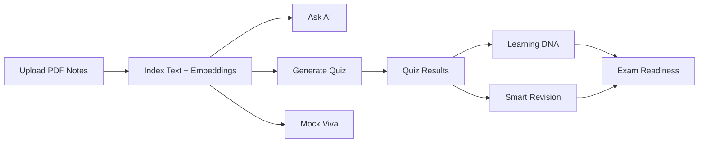

# PrepWise AI

PrepWise AI is an AI-powered study platform that turns static PDF notes into an active learning workspace. It combines note-grounded Q&A, auto-generated quizzes, revision planning, learning analytics, readiness scoring, and mock viva practice in one full-stack application.

## Overview

Most study apps stop at storage or flashcards. PrepWise AI is built around a richer loop:

1. upload notes
2. index them for semantic search
3. ask grounded questions
4. generate quizzes from your own material
5. track retention and study behaviour
6. estimate exam readiness
7. practise viva-style responses with AI feedback

The result is a system that treats your notes as a living knowledge base instead of a passive document archive.

## Features

| Module | What it does |
| --- | --- |
| Notes manager | Upload, list, download, and delete PDF study notes |
| Ask AI | Answers questions using retrieved content from uploaded notes |
| Quiz engine | Generates `MCQ`, `Short Answer`, and `Mixed` quizzes from note context |
| Learning DNA | Builds a behaviour-based study profile from activity and performance history |
| Smart revision | Estimates topic retention with an Ebbinghaus-style forgetting curve |
| Exam readiness | Calculates a weighted readiness score across multiple study signals |
| Mock viva | Runs viva-style question sessions and evaluates answers with AI |

## Product flow



## Architecture

```text
React SPA
   ↓
FastAPI backend
   ├── MongoDB      -> users, notes, results, analytics, revision, readiness, viva
   ├── ChromaDB     -> note chunk embeddings for retrieval
   ├── Local disk   -> uploaded PDFs
   ├── Gemini       -> generation, evaluation, recommendations
   └── MiniLM       -> embedding model
```

For a deeper design write-up, see [`SYSTEM_ARCHITECTURE.md`](./SYSTEM_ARCHITECTURE.md).

## Tech stack

### Frontend

- `React 19`
- `Vite 8`
- `react-router-dom 7`
- `axios`
- `Tailwind CSS 4`
- `lucide-react`

### Backend

- `FastAPI`
- `MongoDB` with `motor`
- `ChromaDB`
- `sentence-transformers/all-MiniLM-L6-v2`
- `google-genai`
- `PyPDF`
- `langchain-text-splitters`
- `PyJWT`
- `slowapi`

## Project structure

```text
aihelper/
├── backend/
│   ├── app/
│   │   ├── core/          # config, security, storage, RAG, Gemini, rate limiting
│   │   ├── db/            # MongoDB connection and activity logging
│   │   ├── models/        # Pydantic schemas
│   │   ├── routes/        # feature routes
│   │   └── main.py        # FastAPI entrypoint
│   ├── requirements.txt
│   └── .env.example
├── frontend/
│   ├── src/
│   │   ├── api/
│   │   ├── components/
│   │   ├── context/
│   │   ├── layouts/
│   │   └── pages/
│   ├── package.json
│   └── .env.example
├── SYSTEM_ARCHITECTURE.md
└── README.md
```

## Local setup

### Prerequisites

- Python `3.11` recommended
- Node.js `18+`
- MongoDB running locally
- Gemini API key

### Backend setup

```bash
cd backend
python -m venv .venv
.venv\Scripts\activate
pip install -r requirements.txt
copy .env.example .env
```

Set the required values in `backend/.env`:

```env
PROJECT_NAME="PrepWise AI"
DEBUG=true
MONGO_URI="mongodb://localhost:27017/studygenie"
JWT_SECRET="replace-with-a-long-random-secret"
GEMINI_API_KEY="replace-with-your-api-key"
CHROMA_PERSIST_DIR="chroma_db"
ALLOWED_ORIGINS="http://localhost:5173,http://127.0.0.1:5173"
```

Run the backend:

```bash
uvicorn app.main:app --reload
```

Useful backend URLs:

- API root: `http://localhost:8000/`
- Swagger docs: `http://localhost:8000/docs`

### Frontend setup

```bash
cd frontend
npm install
copy .env.example .env
npm run dev
```

Default `frontend/.env`:

```env
VITE_API_URL=http://localhost:8000
```

Frontend URL:

- `http://localhost:5173`

## Environment variables

### Backend

| Variable | Required | Description |
| --- | --- | --- |
| `PROJECT_NAME` | No | FastAPI application title |
| `DEBUG` | No | Enables detailed error output |
| `MONGO_URI` | Yes | MongoDB connection string |
| `JWT_SECRET` | Yes | JWT signing secret |
| `JWT_ALGORITHM` | No | Token algorithm, default `HS256` |
| `ACCESS_TOKEN_EXPIRE_MINUTES` | No | Access token lifetime |
| `GEMINI_API_KEY` | Yes | Gemini API key |
| `GEMINI_MODEL` | No | Model name, default `gemini-2.5-flash` |
| `CHROMA_PERSIST_DIR` | No | Chroma persistence path |
| `ALLOWED_ORIGINS` | No | Comma-separated CORS origins |

### Frontend

| Variable | Required | Description |
| --- | --- | --- |
| `VITE_API_URL` | Yes in production | Backend base URL |

## API summary

### Auth

| Method | Endpoint |
| --- | --- |
| `POST` | `/auth/register` |
| `POST` | `/auth/login` |
| `POST` | `/auth/refresh` |
| `GET` | `/auth/profile` |
| `POST` | `/auth/logout` |
| `POST` | `/auth/forgot-password` |
| `POST` | `/auth/reset-password` |

### Notes and AI

| Method | Endpoint |
| --- | --- |
| `POST` | `/notes/upload` |
| `GET` | `/notes` |
| `DELETE` | `/notes/{id}` |
| `GET` | `/notes/{id}/download` |
| `POST` | `/ai/chat` |

### Quiz

| Method | Endpoint |
| --- | --- |
| `POST` | `/quiz/generate` |
| `GET` | `/quiz/{quiz_id}` |
| `POST` | `/quiz/submit` |
| `GET` | `/quiz/result/{result_id}` |
| `GET` | `/quiz/history` |

### Learning analytics

| Method | Endpoint |
| --- | --- |
| `GET` | `/learning-dna` |
| `POST` | `/learning-dna/recalculate` |
| `GET` | `/learning-dna/recommendations` |
| `GET` | `/learning-dna/analytics` |

### Revision

| Method | Endpoint |
| --- | --- |
| `GET` | `/revision/retention` |
| `GET` | `/revision/recommendations` |
| `GET` | `/revision/upcoming` |
| `GET` | `/revision/history` |
| `POST` | `/revision/complete` |
| `POST` | `/revision/recalculate` |
| `GET` | `/revision/ai-tips` |

### Readiness

| Method | Endpoint |
| --- | --- |
| `GET` | `/readiness/overall` |
| `GET` | `/readiness/subjects` |
| `GET` | `/readiness/topics` |
| `GET` | `/readiness/recommendations` |
| `POST` | `/readiness/recalculate` |

### Viva

| Method | Endpoint |
| --- | --- |
| `POST` | `/viva/start` |
| `POST` | `/viva/answer` |
| `POST` | `/viva/complete` |
| `GET` | `/viva/results/{viva_id}` |
| `GET` | `/viva/history` |

## Frontend routes

| Route | Purpose |
| --- | --- |
| `#/login` | Login page |
| `#/register` | Registration page |
| `#/dashboard` | Main dashboard |
| `#/notes/list` | Notes management |
| `#/ai/ask` | Grounded Q&A |
| `#/quiz/generator` | Quiz generation |
| `#/quiz/attempt/:id` | Quiz session |
| `#/quiz/result/:resultId` | Quiz results |
| `#/quiz/history` | Quiz history |
| `#/dna` | Learning DNA, revision, and readiness hub |
| `#/viva` | Viva setup |
| `#/viva/session` | Active viva session |
| `#/viva/results` | Viva results page |
| `#/viva/history` | Viva history |

## Data model

Main MongoDB collections currently used by the application:

- `users`
- `notes`
- `quizzes`
- `quiz_results`
- `user_activities`
- `learning_dna`
- `topic_retention`
- `revision_history`
- `revision_ai_recommendations`
- `exam_readiness`
- `viva_sessions`
- `viva_results`
- `password_resets`
- `token_blocklist`

## Core design ideas

### RAG over personal notes

PrepWise AI does not treat AI as a generic chatbot. The core learning experience is grounded in the student’s own uploaded notes. That makes the system more useful for revision, less likely to drift into unrelated answers, and easier to align with course-specific material.

### Derived learning analytics

The platform calculates learning state from actual user behaviour:

- quiz attempts
- activity history
- revision records
- subject coverage
- note usage

This lets the product build Learning DNA, retention estimates, and readiness scores without forcing the user to manually maintain study logs.

### Retrieval plus generation

The system works because retrieval and generation are used together:

- ChromaDB retrieves relevant note chunks
- Gemini explains, evaluates, summarizes, and recommends

That combination powers Q&A, quizzes, viva grading, and personalised recommendations.

## Quality checks

Available checks in the repository:

```bash
# frontend
npm run lint
npm run build

# backend
ruff check app
python -m pytest
```

These checks are run locally in the current repository snapshot. A committed GitHub Actions workflow is not included.

## Security

- JWT-based authentication is used for protected API routes.
- Passwords are hashed with `bcrypt`.
- Uploaded note retrieval is scoped by user in ChromaDB.
- Several endpoints are protected with rate limiting.
- PDF upload validation checks extension, size, and file signature.

## Current limitations

- Backend automated tests are still minimal.
- Uploaded files are stored on local disk.
- ChromaDB persistence is local-state based.
- Password reset currently logs reset links to the backend console instead of sending email.
- The project does not yet include a production deployment setup such as Docker, object storage, or background workers.

## Troubleshooting

### `VITE_API_URL` is missing in production

The frontend intentionally shows a visible error banner if `VITE_API_URL` is not defined in a production build. Set it to the deployed backend URL before releasing.

### AI says it cannot find the answer

This usually means:

- the note is still indexing
- the PDF has little or no extractable text
- the question does not match the uploaded note content closely enough

### Password reset appears not to work

In the current implementation, the reset link is printed to the backend console for development use. It is not emailed automatically.

## Roadmap

Suggested next improvements for the project:

- add real backend test coverage for main flows
- move file storage to object storage
- add background workers for indexing and long AI tasks
- add Docker-based local and deployment setup
- improve production observability and caching

## Contributing

If you want to extend the project:

1. create a feature branch
2. make focused changes
3. run lint and test checks
4. open a pull request with a clear summary

## License

No license file is currently present in the repository. Add one before public redistribution if you want the project to have an explicit usage license.
