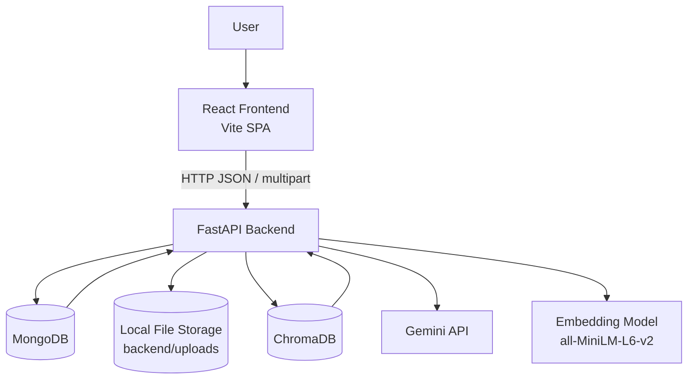
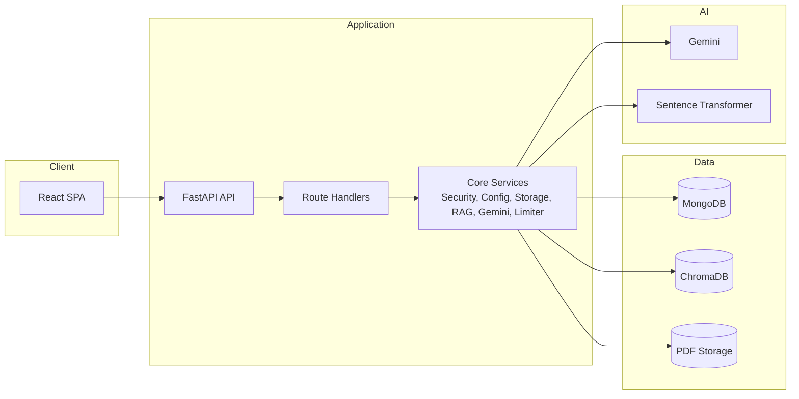
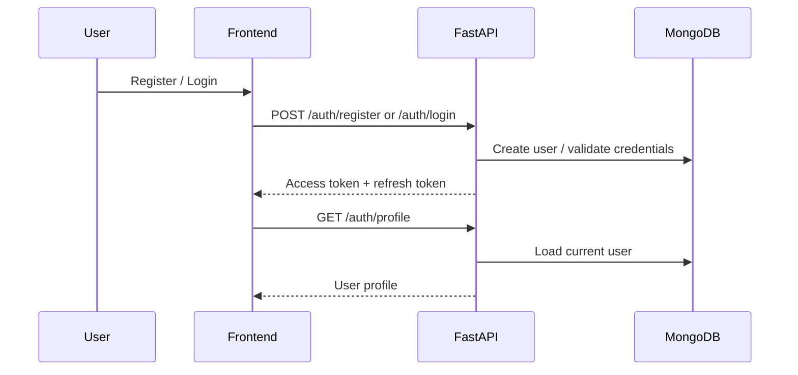
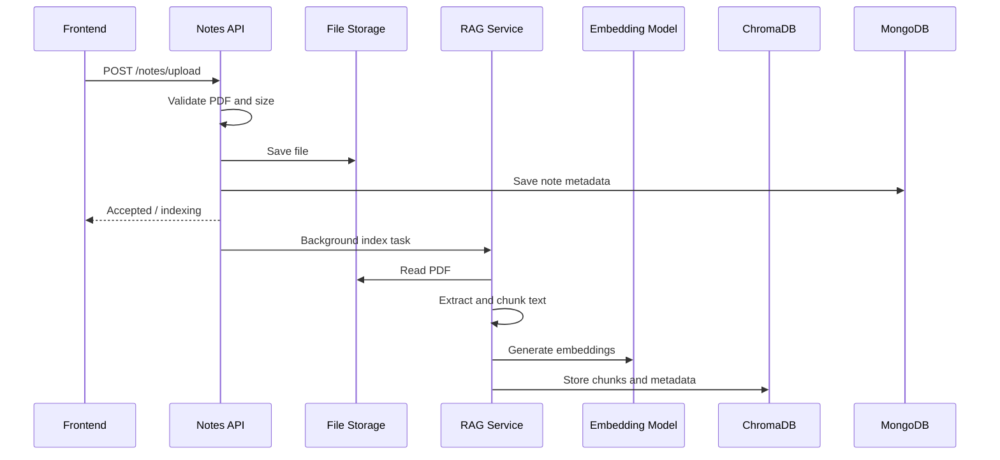
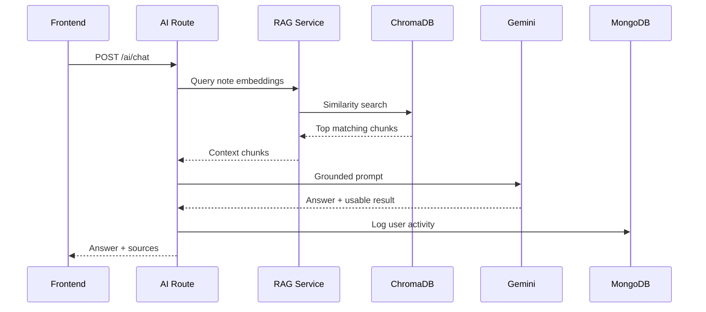
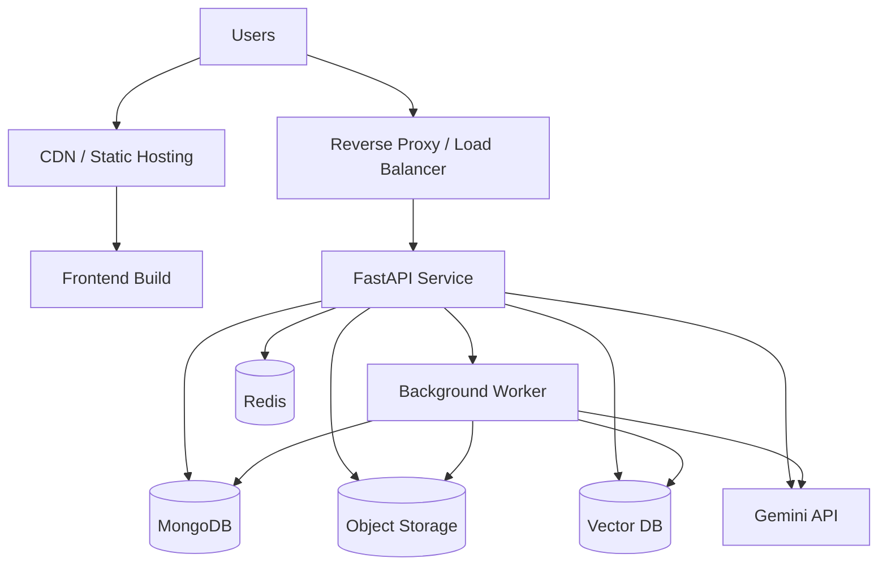

# PrepWise AI System Architecture

This document describes the current system design of `PrepWise AI`, a full-stack AI-assisted study platform built around note-grounded learning workflows. It covers the runtime architecture, major modules, data flow, storage design, and the main technical trade-offs in the present implementation.

## Purpose

PrepWise AI helps a student move from static PDF notes to active study loops:

- upload notes
- ask grounded questions
- generate quizzes
- track learning behaviour
- schedule revision
- estimate exam readiness
- run mock viva sessions

The system is designed as a client-server application with a React frontend, a FastAPI backend, MongoDB for application data, ChromaDB for vector search, local file storage for uploaded PDFs, and Gemini for generation and evaluation tasks.

## High-level architecture



## Runtime view

### Frontend

The frontend is a single-page application built with `React`, `Vite`, `react-router-dom`, and `axios`. It uses `HashRouter`, lazy-loaded pages, a shared auth context, and protected routes for authenticated sections such as quiz, DNA, revision, and viva workflows.

Main frontend responsibilities:

- user authentication flow
- note upload and management UI
- quiz, viva, and dashboard screens
- token storage and refresh handling
- rendering analytics and progress views

### Backend

The backend is a `FastAPI` application that exposes REST endpoints under feature-based routers:

- `auth`
- `notes`
- `ai`
- `quiz`
- `learning_dna`
- `revision`
- `readiness`
- `viva`

Main backend responsibilities:

- request validation
- JWT authentication
- rate limiting
- file validation and storage
- PDF extraction and indexing
- RAG retrieval and grounded generation
- quiz and viva evaluation
- analytics, scoring, and recommendation logic

## Container-level design



## Backend module design

### `app/main.py`

This is the application entrypoint. It creates the FastAPI instance, connects to MongoDB during startup, ensures the upload directory exists, installs CORS and exception middleware, enables rate limiting, and registers all feature routers.

### `app/core`

Core services are centralized here:

- `config.py`: loads environment-based configuration
- `security.py`: password hashing and JWT encode/decode helpers
- `limiter.py`: `slowapi` limiter setup
- `storage.py`: local file storage abstraction
- `gemini.py`: shared Gemini client
- `rag.py`: PDF extraction, chunking, embedding, vector indexing, and retrieval

This layout keeps route files thinner and reduces duplication of shared logic.

### `app/db`

`mongodb.py` handles MongoDB connection lifecycle, database selection, index creation, and activity logging. The activity log is important because multiple higher-level modules derive scores from user interactions rather than only from explicit exam attempts.

### `app/routes`

Each route file maps closely to a product capability:

| Route module | Responsibility |
| --- | --- |
| `auth.py` | register, login, refresh, logout, password reset |
| `notes.py` | note upload, listing, deletion, download |
| `ai.py` | grounded question answering from indexed notes |
| `quiz.py` | quiz generation, submission, scoring, history |
| `learning_dna.py` | behavioural profiling and analytics |
| `revision.py` | forgetting-curve retention and revision recommendations |
| `readiness.py` | weighted exam readiness scoring |
| `viva.py` | mock viva generation, answer evaluation, result tracking |

## Frontend module design

### Routing and session model

The frontend uses `HashRouter` with:

- public routes for authentication
- protected routes for product features
- an auth context that verifies the current session through `/auth/profile`
- axios interceptors that attach bearer tokens and attempt refresh on `401`

### Page structure

The UI is organized around pages and reusable components:

- `pages/` contains product screens
- `components/` contains cards, charts, question widgets, timers, and progress elements
- `layouts/` contains shared shell structure
- `context/` stores auth state
- `api/axios.js` centralizes API communication

This is a practical feature-driven SPA structure suited to a dashboard-style product.

## Data flow by feature

### 1. Authentication



Authentication is token-based. Passwords are hashed with `bcrypt`, access and refresh tokens are signed with JWT, and a token blocklist is used to invalidate logged-out access tokens.

### 2. Note ingestion and indexing



This is the foundation for the rest of the product. Uploaded PDFs are stored on disk, while semantic chunks are stored in ChromaDB per user collection.

### 3. Ask AI



The backend explicitly instructs Gemini to answer only from retrieved context. If nothing relevant is found, the user receives a note-grounded failure message rather than an unconstrained answer.

### 4. Quiz generation and submission

Quiz generation uses retrieved note context plus Gemini JSON output. The system stores generated quiz documents and later stores quiz result documents after evaluation. MCQs are checked directly, while short answers may be graded semantically through Gemini with a simple fallback strategy if AI evaluation fails.

### 5. Learning DNA

Learning DNA is derived, not directly authored. It analyzes:

- quiz performance
- subject and topic trends
- activity frequency
- notes uploaded
- AI question count
- inferred discipline and consistency

This module acts as an analytics layer over raw study behaviour.

### 6. Smart revision

The revision engine uses quiz history and revision count to estimate retention with an Ebbinghaus-style decay formula:

```text
R = 100 × e^(−t / S)
```

Where:

- `R` is retention
- `t` is days since last study or revision
- `S` is stability, influenced by quiz score and revision count

This creates revision recommendations, urgency ranking, upcoming schedules, and AI-generated revision tips.

### 7. Exam readiness

Exam readiness combines multiple signals into a weighted score:

- quiz performance
- retention
- study consistency
- revision completion
- subject coverage
- learning DNA score

This is essentially a composite scoring service layered above quiz, revision, and behaviour data.

### 8. Mock viva

The viva engine creates oral-style questions from a subject-focused retrieval query, evaluates student answers, stores question-by-question feedback, and produces a final result document with grade, strengths, weaknesses, and missing concepts.

## Persistence design

### MongoDB

MongoDB is the primary operational data store. It contains:

- identity and user records
- note metadata
- quiz definitions
- quiz results
- activity history
- learning DNA profiles
- topic retention documents
- revision history
- readiness cache
- viva sessions and viva results
- password reset and token blocklist records

This is a good fit because the product uses flexible, document-like records that vary by feature and evolve over time.

### ChromaDB

ChromaDB stores note chunks and embeddings for semantic retrieval. Collections are partitioned by user, which reduces accidental cross-user retrieval and simplifies authorization boundaries in the retrieval layer.

### Local file storage

Uploaded PDFs are saved under `backend/uploads`. This is acceptable for local development, but it tightly couples the backend process to local disk state.

## Key design decisions

### Why FastAPI

FastAPI is a strong fit because:

- the application is API-centric
- request and response schemas matter
- async database access is used
- developer productivity is high
- Swagger docs come for free

### Why MongoDB

The platform stores heterogeneous documents such as quiz results, revision records, viva sessions, and behavioural analytics. MongoDB handles this model naturally without introducing a complex relational schema too early.

### Why ChromaDB plus Gemini

The product needs both retrieval and generation:

- ChromaDB solves semantic note retrieval
- Gemini solves explanation, generation, grading, and recommendations

This hybrid pattern is the core design idea behind the system.

### Why derived analytics instead of manual study planning

The system tries to infer learner state from user actions, not just from manually entered schedules. That lets the product generate more adaptive outputs with less user effort.

## Security design

Current security controls include:

- JWT-based authentication
- hashed passwords using `bcrypt`
- protected routes on both frontend and backend
- access-token invalidation with a token blocklist
- CORS allowlist configuration
- user-scoped note retrieval in vector search
- upload validation for extension, size, and MIME signature
- rate limiting on selected endpoints

## Quality attributes

### Strengths

- clear separation between UI, API, operational data, vector search, and LLM calls
- feature-oriented backend routing
- strong product alignment between stored data and analytics modules
- good foundation for iterative AI product development

### Current constraints

- uploaded files are stored on local disk
- vector storage is local-state based
- AI dependencies are synchronous external calls in critical paths
- backend automated tests are minimal
- some analytics are heuristic rather than validated against educational benchmarks

## Scalability considerations

### Current scaling profile

The current design is suitable for:

- single developer setup
- local demos
- early stage prototype or portfolio project
- moderate single-instance workloads

### Bottlenecks if usage grows

- local file storage prevents easy horizontal scaling
- local Chroma persistence complicates multi-instance deployment
- embedding generation can be CPU-heavy
- Gemini latency can affect response time for quiz and viva workflows
- some routes perform aggregation-heavy calculations on request

### Recommended evolution path

If the system needs to evolve toward production, the next architectural steps should be:

1. Move uploaded files to object storage such as S3.
2. Move vector storage to a managed or shared deployment model.
3. Introduce background workers for indexing and long-running AI tasks.
4. Add Redis for caching and task coordination.
5. Containerize frontend and backend with Docker.
6. Add stronger backend test coverage and contract tests for core routes.

## Deployment design

A practical production target architecture would look like this:



## Suggested repository placement

This document is intentionally written in Markdown with Mermaid diagrams so it renders well directly on GitHub. It can serve as:

- a contributor-facing architecture guide
- a portfolio design document
- a base for future deployment and refactoring decisions

## Summary

PrepWise AI is built around a clean and understandable architecture for an AI-first study platform:

- React frontend for user workflows
- FastAPI backend for business logic
- MongoDB for operational and analytics data
- ChromaDB for semantic retrieval
- local PDF storage for note ingestion
- Gemini for generation, grading, and recommendations

The current system is a strong prototype architecture. Its next maturity step is not a total redesign, but operational hardening: better testing, background processing, shared storage, and production-friendly deployment patterns.
